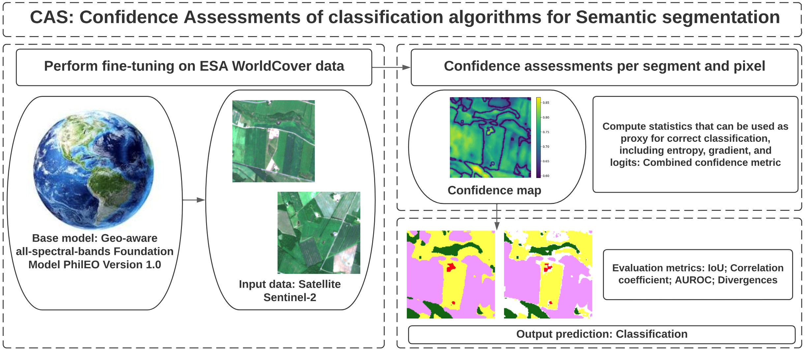

# CAS_Confidence_Assessment
**CAS: Confidence Assessment of classification algorithms for Semantic segmentation of EO data**

GitHub repo of paper  


**Title of paper:** Fine-Tuning EO Foundation Models with Confidence Assessment for enhanced Semantic segmentation (CAS)      


**Abstract of paper:**

Confidence assessments of semantic segmentation algorithms are important. Ideally, models should have the ability to predict in advance whether their output is likely to be incorrect. Assessing the confidence levels of model predictions in Earth Observation (EO) classification is essential, as it can enhance semantic segmentation performance and help prevent high error rates during inference. The model we developed, Confidence Assessment for enhanced Semantic segmentation (CAS), evaluates confidence at both the segment and pixel levels, providing both labels and confidence scores as output. Our model, CAS, identifies segments with incorrect predicted labels using the proposed combined confidence metric, refines the model, and enhances its performance. This work has many significant applications, particularly in evaluating EO Foundation Models on semantic segmentation downstream tasks, such as land cover classification using Sentinel-2 satellite data. The evaluation shows that the proposed model CAS is effective and outperforms other baseline models. 

Index Terms - Earth Observation (EO), AI4EO, Remote Sensing, EO Foundation Models, Evaluation Framework, Confidence assessment.     

Confidence Assessment for enhanced Semantic segmentation (CAS) model


**Authors of paper:**
Nikolaos Dionelis and Nicolas Longepe

European Space Agency (ESA)

Φ-lab, ESA, ESRIN, Italy


## Flowchart Diagram:



Figure 1: Flowchart of the proposed model CAS for semantic segmentation confidence assessment.  


## Brief Discussion about the Model:

We develop a model for confidence assessment of semantic segmentation classification of multi-spectral data, i.e. data from Sentinel-2. 


Tested with: Python 3.10.13

Code in PyTorch

We have used the Visual Studio Code IDE Code Editor.

This GitHub repo will be updated shortly! Stay tuned!  

## CAS Results

The main results and the key outcomes of the proposed model CAS can be found in the paper "Fine-Tuning EO Foundation Models with Confidence Assessment for enhanced Semantic segmentation (CAS)".

## Acknowledgement:

All the acknowledgements, references, and citations for the model CAS can be found in our paper "Fine-Tuning EO Foundation Models with Confidence Assessment for enhanced Semantic segmentation (CAS)". 

## If you use our code, please cite:

Nikolaos Dionelis and Nicolas Longepe, "Fine-Tuning EO Foundation Models with Confidence Assessment for enhanced Semantic segmentation (CAS)," To appear, 2024.

```
@misc{dionelis2024,
  title        = "Fine-Tuning EO Foundation Models with Confidence Assessment for enhanced Semantic segmentation (CAS)",
  author       = "Nikolaos Dionelis and Nicolas Longepe",
  year         = 2024,
  note         = "To appear"
} 
```

If you would like to get in touch, please contact: [Nikolaos.Dionelis@esa.int](mailto:Nikolaos.Dionelis@esa.int?subject=[GitHub]).

## Further Information

Paper: "Fine-Tuning EO Foundation Models with Confidence Assessment for enhanced Semantic segmentation (CAS)"  

Submitted to IEEE   

European Space Agency (ESA), ESRIN, Φ-lab, Italy: [ESA Φ-lab](http://philab.esa.int)

